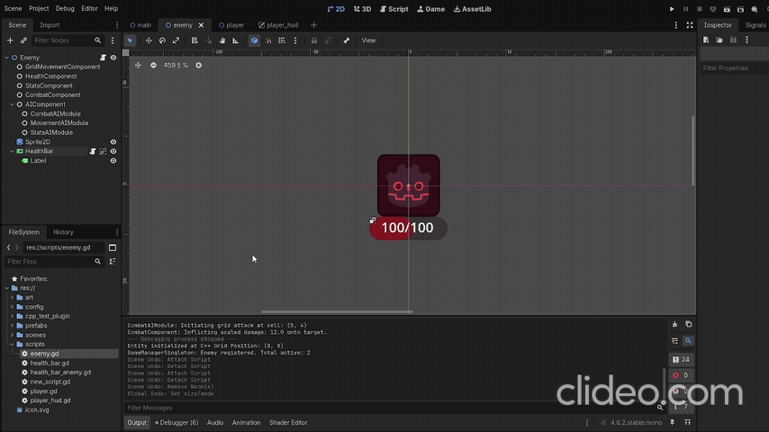
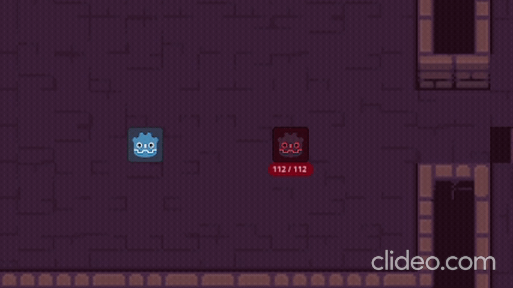

# GDExtension Grid-RPG Framework (GGRF)

A high-performance, component-based framework built with **C++ (GDExtension)** for the **Godot 4.6+** engine. It is designed for rapid and flexible development of turn-based 2D RPGs and tactical roguelikes on a rectangular grid.

The primary goal of the framework is to provide developers and game designers with a modular "system constructor" (architectural template) that minimizes code coupling and delivers native-level performance.

## Technology Stack
* **Game Engine:** Godot 4.6.2+
* **Programming Language:** C++17
* **Integration Technology:** GDExtension (`godot-cpp`)
* **Build System:** SCons (featuring a custom `SConstruct` script with automated recursive subdirectory scanning via Python)

  
   
  <i>Core gameplay showcase: Synchronized world ticks driving multiple active enemy AI targets pursuing the player across the grid map.</i>

---

## Key Architectural Decisions

### 1. Low Coupling and Component-Based Design
All entity logic is decoupled into isolated components (inheriting from a common `BaseComponent` class). Components interact with each other indirectly via events/signals and cached interfaces. This architecture prevents cascading failures: for instance, removing a combat module or missing stats on an object is safely handled by the code without crashing the engine.

### 2. Component Container Pattern (Actor Engine)
The core entity node (`Actor`, inherited from `Node2D`) acts as a centralized container.
* To prevent conflicts with GDScript method overrides, initialization is handled natively via `_notification(NOTIFICATION_POST_ENTER_TREE)`. The node scans its children, filters out raw engine nodes, and caches pointers to gameplay components.
* Component retrieval in runtime is optimized into a templated O(1) hash table lookup using Godot's native types: `actor->get_component<T>()` with an internal `HashMap<StringName, Node*>`. This eliminates expensive child-traversal calls via the engine API.

### 3. Business Logic and View Separation (Data/View)
Heavy computations, game rule validation, and coordinate transformations are encapsulated entirely on the C++ side.
* **C++ Layer:** Validates tile walkability, computes A* paths, tracks object IDs, and processes RPG damage formulas influenced by attributes.
* **GDScript Layer:** Handles lightweight tasks—reading user input, UI state management, triggering animations, and executing visual interpolations (Tweens) for smooth character movement across pixel coordinates.

### 4. Crash Safety and Hot Reload Resilience
Global systems (map tracking, turn management) are orchestrated via scene-based custom C++ singletons utilizing a native static `get_singleton()` access point.
* Entities on the grid and within turn queues are tracked using numerical `uint64_t` identifiers (`ObjectID`) stored inside `std::unordered_set`.
* Object validity is verified on demand via `ObjectDB::get_instance()`. This provides robust protection against wild pointers and crashes when dynamically freeing nodes (`queue_free()`) or hot-reloading the GDExtension DLL inside the editor.

  
   
  <i>Demonstration of a modular Enemy entity functioning with near-zero GDScript, driven entirely by native C++ GDExtension components.</i>

  
   
  <i>Fault tolerance showcase: The Enemy entity continues to run and navigate smoothly even after CombatComponent, StatsComponent, and CombatAIModule are completely deleted from its tree.</i>

---

## Framework Module Structure

### Core
* `Actor`: The base entity class providing an O(1) `HashMap` component cache.
* `BaseComponent`: The abstract C++ class for all entity sub-systems, enforcing safe two-phase initialization.

### Singletons
* `GridMapSingleton`: Central grid controller. It parses collision data from `TileMapLayer`, manages a state matrix, and translates world pixels to grid cells (and vice versa) while respecting the map's `Scale` and transform offsets.
* `GameManagerSingleton`: The core world tick driver. It dynamically manages the active entity list via ObjectIDs, triggers AI decision-making ticks, and receives action-completion callbacks.

### Components
* `GridMovementComponent`: Logical controller for cell-by-cell movement. Validates target tile availability, rewrites map occupancy data, triggers floor effect callbacks, and passes motion signals down to GDScript.
* `StatsComponent`: Data-driven container for RPG characteristics (Strength, Agility, Vitality, Endurance). Connected to a scriptable `StatsBalanceConfig` resource to dynamically compute derived attributes (crit, evasion, attack bonuses).
* `HealthComponent`: Manages damage tracking. Automatically scales maximum health when owner stats change, processing incoming damage through mitigation and dodge formulas.
* `CombatComponent`: Logic node for grid-based attacks. Responsible for locating targets in the attack direction and scaling base weapon damage based on the attacker's strength attribute.
* `LevelComponent`: Placeholder component prepared for handling experience gain, level progression, and RPG class attributes.

  
   
  <i>Data-driven parameter scaling: Changing the Vitality attribute in the Inspector instantly recalculates and updates the Enemy's maximum and current health pool in real-time.</i>

### Artificial Intelligence (AI System)
The main `AIComponent` acts as a high-level orchestrator managing hidden child nodes (`Node`), allowing designers to customize enemy and civilian NPC behaviors like building blocks directly in the Godot Inspector:
* `StateAIModule`: A Finite State Machine (FSM) evaluating the current behavioral pattern (Wander, Chase, Combat) based on Manhattan distance metrics.
* `MovementAIModule`: Navigation logic. Encapsulates the `AStarGrid2D` algorithm, updates obstacle maps dynamically, and implements turn-based cooldowns to eliminate the "parallel path прилипание" (sticking) bug.
* `CombatAIModule`: Manages close-quarters combat execution and action priority during engagement phases.

---

## Future Roadmap

* [ ] **Utility AI Expansion:** Upgrade `StateAIModule` to an advanced Utility AI scoring system using dynamic action weights and mathematical curves.
* [ ] **AI Perception Systems:** Implement a full Perception Module to handle field-of-view ranges, vision cones, and grid-based raycasting.
* [ ] **AI Memory Module:** Add tracking for the player's Last Known Position on the grid when visual contact is broken.
* [ ] **Inventory and Equipment:** Create an equipment manager component that dynamically applies item stats and weapon damage modifiers to `StatsComponent`.
* [ ] **Status Effects System:** Implement buffs, debuffs, Damage over Time (DoT), and interactive tile hazards (fire, poison, puddles).
* [ ] **Civilian NPC Behaviors:** Build modules for peaceful NPC routines, including trading mechanics and dialogue-tree interfaces.

---
---

# GDExtension Grid-RPG Framework (GGRF) [РУССКАЯ ВЕРСИЯ]

Высокопроизводительный модульный фреймворк на базе **C++ (GDExtension)** для движка **Godot 4.6+**, предназначенный для быстрой и удобной разработки пошаговых 2D RPG и тактических рогаликов на прямоугольной сетке.

Главная цель проекта — предоставить разработчикам и геймдизайнерам гибкий конструктор систем (архитектурный шаблон), минимизирующий связанность кода (coupling) и обеспечивающий нативный уровень производительности.

## Стек технологий
* **Игровой движок:** Godot 4.6.2+
* **Язык программирования:** C++17
* **Технология интеграции:** GDExtension (`godot-cpp`)
* **Система сборки:** SCons (скрипт `SConstruct` с автоматическим динамическим сканированием вложенных директорий на Python)

  
   
  <i>Общая демонстрация игрового процесса: синхронные пошаговые тики мира управляют группой активных противников, преследующих игрока по сетке уровня.</i>

---

## Ключевые архитектурные решения

### 1. Низкая связанность и компонентный дизайн
Вся логика сущностей разделена на изолированные компоненты (наследники общего класса `BaseComponent`). Компоненты взаимодействуют между собой опосредованно, через систему событий/сигналов и кэшированные интерфейсы. Это исключает каскадные ошибки: например, удаление боевого модуля или отсутствие стат у объекта не приводит к падению игры, а безопасно обрабатывается системой.

### 2. Паттерн Component Container (Actor Engine)
Базовый узел сущностей (`Actor`, унаследованный от `Node2D`) выполняет роль контейнера. 
* Чтобы избежать конфликтов с переопределением функций в GDScript, инициализация кэша вынесена в нативное уведомление `_notification(NOTIFICATION_POST_ENTER_TREE)`. Узел сканирует своих детей, фильтрует обычные ноды Godot и кэширует указатели на логические компоненты.
* Поиск любого компонента в рантайме внутри C++ сведен к шаблонной O(1) операции с использованием родных типов Godot: `actor->get_component<T>()` на базе внутренней `HashMap<StringName, Node*>`. Это устраняет необходимость дорогостоящего перебора дочерних элементов через API движка.

### 3. Разделение бизнес-логики и визуализации (Data/View)
Вся тяжелая вычислительная логика, валидация игровых правил и координатные преобразования инкапсулированы на стороне C++. 
* **C++ слой:** Проверяет проходимость ячеек, рассчитывает маршруты A*, управляет ID объектов, вычисляет формулы RPG-урона с учетом атрибутов.
* **GDScript слой:** Отвечает за легкие задачи — считывание пользовательского ввода, управление интерфейсом (UI), переключение анимаций и запуск визуальных интерполяций (Tween) для плавного перемещения спрайтов по пиксельным координатам.

### 4. Отказоустойчивость при Hot Reload и уничтожении объектов
Для координации игровых систем (карта уровня, менеджер ходов) используются кастомные C++ синглтоны на сцене с нативной статической точкой доступа `get_singleton()`. 
* Хранение объектов на сетке и в очереди ходов реализовано через числовые `uint64_t` идентификаторы (`ObjectID`) внутри `std::unordered_set`. 
* При обращении к объекту его валидность проверяется через `ObjectDB::get_instance()`. Это гарантирует 100% защиту от «диких» указателей (wild pointers) и крашей при динамическом удалении врагов (`queue_free()`) или горячей перезагрузке DLL-библиотеки в редакторе.

  
   
  <i>Демонстрация работы модульной сущности Enemy с минимальным объемом GDScript-кода, управляемой исключительно нативными C++ компонентами.</i>

  
   
  <i>Пример низкой связанности систем: сущность Enemy продолжает стабильно работать и перемещаться по карте даже после полного удаления узлов CombatComponent, StatsComponent и CombatAIModule из её дерева.</i>

---

## Структура модулей фреймворка

### Ядро (Core)
* `Actor`: Базовый класс сущности, предоставляющий интерфейс O(1) `HashMap` кэша для систем-компонентов.
* `BaseComponent`: Абстрактный C++ класс для всех игровых систем, реализующий безопасную двухфазную инициализацию компонентов.

### Синглтоны (Singletons)
* `GridMapSingleton`: Центральный контроллер сетки. Считывает данные проходимости из `TileMapLayer`, хранит матрицу состояний ячеек, автоматически переводит мировые пиксели в координаты сетки (и обратно) с учетом масштаба (`Scale`) и смещения уровня.
* `GameManagerSingleton`: Центральный контроллер пошаговых тиков мира. Управляет списком активных сущностей на основе их ObjectID, запускает фазу принятия решений ИИ и принимает уведомления о завершении действий.
  
### Компоненты (Components)
* `GridMovementComponent`: Логический контроллер пошагового шага. Проверяет доступность целевой клетки, перезаписывает данные о нахождении объекта на карте, активирует триггеры эффектов пола и передает сигналы перемещения в GDScript.
* `StatsComponent`: Data-driven хранилище RPG-характеристик (Сила, Ловкость, Живучесть, Выносливость). Работает в связке с ресурсом баланса (StatsBalanceConfig) и динамически рассчитывает производные атрибуты (крит, уклонение, бонусы урона).
* `HealthComponent`: Отвечает за учет здоровья. Автоматически пересчитывает максимальный запас ХП при изменении стат владельца, обрабатывает входящий урон с учетом формул снижения повреждений и шансов уклонения.
* `CombatComponent`: Логический узел атаки. Отвечает за поиск цели на сетке в направлении удара и скейлинг базового урона от показателя силы атакующего.
* `LevelComponent`: Модуль учета опыта, прокачки уровней и классов персонажа (подготовлен к интеграции).

  
   
  <i>Data-driven масштабирование: изменение показателя Vitality (Живучесть) в инспекторе Godot мгновенно запускает нативный пересчет и обновляет максимальный запас здоровья врага в реальном времени.</i>

### Искусственный Интеллект (AI System)
Главный компонент `AIComponent`: спроектирован как высокоуровневый координатор, управляющий скрытыми дочерними узлами-модулями (Node), что позволяет настраивать поведение врагов и мирных NPC как конструктор прямо в инспекторе Godot:
* `StateAIModule`: Конечный автомат (FSM), определяющий текущую модель поведения (Wander, Chase, Combat) на основе Манхэттенского расстояния.
* `MovementAIModule`: Логика навигации. Инкапсулирует в себе алгоритм AStarGrid2D, динамически обновляет проходимость препятствий на карте и реализует кулдауны на шаги (решение проблемы «параллельного прилипания» ИИ к игроку).
* `CombatAIModule`: Отвечает за триггер боевых действий и приоритет выбора атак в фазе ближнего боя.

---

## Дорожная карта развития (Roadmap)

* [ ] **Расширение Utility AI:** Перевод StateAIModule на систему оценки полезности действий с использованием динамических весов и математических кривых.
* [ ] **Органы чувств ИИ:** Реализация полноценного модуля восприятия (Perception Module) с радиусом обзора, конусами зрения и пуском лучей (Raycasting) по сетке.
* [ ] **Модуль памяти ИИ:** Добавление отслеживания последней известной позиции игрока (Last Known Position) при потере визуального контакта.
* [ ] **Система предметов и инвентаря:** Разработка компонента экипировки, динамически модифицирующего базовые параметры StatsComponent при смене оружия или брони.
* [ ] **Система эффектов (Status Effects):** Реализация механики баффов/дебаффов, периодического урона (DoT) и интерактивных эффектов на тайлах карты (огонь, яд, замедление).
* [ ] **Поведение NPC:** Написание модулей для мирного поведения, включая торговые системы и интеграцию с диалоговыми деревьями.

---
---

